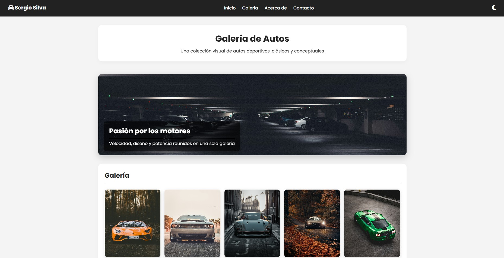

# 🚘 Galería con Lightbox | Sergio Silva

Explora una galería visual interactiva de autos deportivos, clásicos y conceptuales con efecto Lightbox, diseñada con HTML, CSS y JavaScript.



## 🔍 Descripción

Este proyecto web presenta una galería moderna y responsiva que permite ampliar imágenes en un modal estilo *lightbox*. Ha sido desarrollado como parte del portafolio de Sergio Silva, aplicando principios de accesibilidad, SEO, animaciones con AOS.js y optimización de rendimiento.

## 🧩 Características

- Galería interactiva con efecto Lightbox
- Tema claro/oscuro con toggle accesible
- Diseño 100% responsive
- Accesibilidad mejorada (teclado, ARIA, alt)
- SEO optimizado: metadatos, OpenGraph, Twitter Card, JSON-LD
- Lazy loading de imágenes
- Animaciones con AOS.js
- Estructura HTML semántica y ordenada
- Íconos con Font Awesome

## 🛠️ Tecnologías

- **HTML5**
- **CSS3**
- **JavaScript**
- [Font Awesome](https://fontawesome.com/)
- [AOS.js](https://michalsnik.github.io/aos/)
- [Google Fonts - Poppins](https://fonts.google.com/specimen/Poppins)

## 📁 Estructura de carpetas


## ⚙️ Funcionalidades destacadas

- Modal de imagen con botones `prev/next` y cierre con `Escape`
- Header fijo con navegación semántica
- Animaciones al hacer scroll
- Carga diferida de scripts y medios
- Favicon personalizado con múltiples tamaños
- Footer social dinámico con íconos y año actualizado

## 📈 SEO

- ✅ Etiquetas `meta` correctamente configuradas
- ✅ Etiquetas Open Graph y Twitter Card
- ✅ JSON-LD con `WebSite` y `CreativeWork`
- ✅ `sitemap.xml` y `robots.txt` generados
- ✅ Etiqueta `lang="es-CO"` y `dir="ltr"`

## 🧪 Accesibilidad

- Navegación por teclado con `Tab` y `Escape`
- `role`, `aria-label` y elementos semánticos (`nav`, `main`, `section`, `footer`)
- Textos alternativos `alt` descriptivos en todas las imágenes

## 📦 Instalación (opcional para clonar localmente)

```bash
git clone https://github.com/sergiosilva-dev/galeria-lightbox.git
cd galeria-lightbox
Abrir index.html en el navegador.
```

## 🌐 Enlace al proyecto
🔗 https://sergiosilva-dev.github.io/galeria-lightbox

## 📄 Licencia
Este proyecto está licenciado bajo la [MIT License](LICENSE).

> Proyecto desarrollado con ❤️ por [Sergio Silva](https://github.com/sergiosilva-dev)

---
